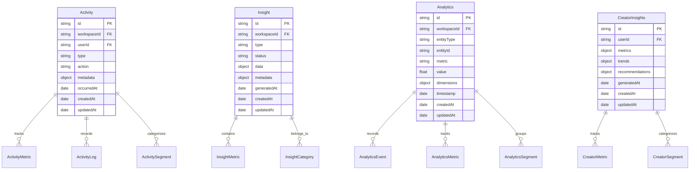

# Vurvey API Entities and Relations

This document provides a comprehensive overview of the Vurvey API's database schema and entity relationships. The documentation is organized by core domains and includes relationship diagrams to help visualize the connections between different entities.

## Core Domains

### 1. Workspace Management


### 2. User Management and Social Features


### 3. AI and Chat System

The AI and Chat System is a comprehensive component that handles AI-powered interactions, task orchestration, and chat functionality. It integrates with various services and manages the flow of AI-driven conversations and analysis.

#### Entity Relationships


#### Key Components and Flows

1. **AI Service Integration**


2. **Task Processing Pipeline**
   - **Validation Phase**
     * Validates task parameters and context
     * Ensures required data is present
     * Checks permissions and access rights
   
   - **Context Preparation**
     * Gathers relevant workspace data
     * Loads user preferences and history
     * Prepares training data if needed
   
   - **Execution Phase**
     * Constructs optimized prompts
     * Manages LLM API interactions
     * Handles response streaming
     * Processes and validates results
   
   - **Event Publishing**
     * Notifies relevant systems of completion
     * Updates task status and metrics
     * Triggers dependent workflows

3. **AI Service Configuration**
   - **Provider Integration**
     * Supports multiple LLM providers (Anthropic, OpenAI)
     * Configurable model selection
     * Flexible API key management
   
   - **Model Parameters**
     * Adjustable token limits
     * Temperature control for response variety
     * Context window management
     * Response format specifications

4. **System Optimization**
   - **Caching Strategy**
     * Prompt template caching
     * Similar request detection
     * Response caching for common queries
   
   - **Performance Features**
     * Parallel task processing
     * Batch request optimization
     * Streaming for long responses
     * Dynamic resource allocation
   
   - **Resource Management**
     * Token usage monitoring
     * Rate limit handling
     * Cost optimization
     * Error recovery mechanisms

### 4. Survey System and Templates


### 5. Content and Media Management


### 6. Engagement and Analytics


### 7. Reward and Incentive System


### 8. Segmentation and Targeting


## Cross-Domain Relationships

### Survey and AI Integration


### User Engagement Flow


### Security and Access Control

The system implements a comprehensive role-based access control (RBAC) system that operates at multiple levels:

#### Workspace Level Access

1. **Workspace Roles and Capabilities**
   - **Owner**
     - Full access to workspace and all its resources
     - Can manage workspace settings, billing, and integrations
     - Can assign/revoke admin roles
     - Can delete the workspace
   
   - **Administrator**
     - Can manage workspace settings and users
     - Can create and manage surveys
     - Can manage datasets and file permissions
     - Cannot modify billing or delete workspace
   
   - **Member**
     - Can participate in workspace activities
     - Can create and manage their own surveys
     - Can access shared datasets with granted permissions
     - Cannot modify workspace settings
   
   - **Guest**
     - Limited access to specific resources
     - Can view and respond to shared surveys
     - Cannot create new resources
     - Cannot access sensitive data

2. **File and Dataset Permissions**

   a. **Permission Management**
   - Only Workspace Owners and Administrators can:
     - Set default access levels for datasets
     - Grant or revoke access permissions
     - Create and manage sharing rules
     - Set file retention policies
   
   b. **Access Levels**
   - **Private** (Default)
     - Only accessible to file owner and explicitly granted users
     - Requires specific permissions for viewing or editing
     - Not visible in workspace-wide searches
   
   - **Workspace-Public**
     - Accessible to all workspace members
     - Different permission levels can be set:
       * View Only: Can only view and download
       * Comment: Can view and add comments
       * Edit: Can modify file contents
       * Manage: Can change permissions and delete
   
   - **Anonymous**
     - Accessible via public link
     - No authentication required
     - Read-only access
     - Time-limited access possible

   c. **Permission Inheritance**
   - Files inherit default permissions from their parent dataset
   - Dataset permissions cascade to all contained files
   - Individual file permissions can be overridden
   - Permission changes can be applied:
     * To single files
     * To specific file types
     * To entire datasets
     * To all future uploads

3. **Practical Implementation**
   - Permission changes require explicit action
   - Bulk permission updates available for datasets
   - Audit trail maintained for all permission changes
   - Automatic notifications for permission changes
   - Regular permission review reminders for sensitive data

4. **Security Measures**
   - All file access is logged
   - Suspicious access patterns are flagged
   - Version history maintained for critical files
   - Automatic file scanning for security threats
   - Regular permission audits

## Integration Points

### 1. Media Processing Integration


---


### Survey Insights & Analysis


1. **Question-Level Insights**
   - Individual response analysis
   - Response distribution
   - Sentiment analysis
   - Key themes and patterns
   - Word clouds for text responses
   - Video response highlights

2. **Survey-Level Insights**
   - Cross-question correlations
   - Overall sentiment trends
   - Key findings summary
   - Demographic breakdowns
   - Completion rate analysis
   - Response quality metrics

3. **Response Analysis Tools**
   - Filter responses by criteria
   - Compare segments
   - Export raw data
   - Generate reports
   - Share insights
   - Track changes over time

4. **AI-Powered Analysis**
   - Automatic theme detection
   - Sentiment classification
   - Pattern recognition
   - Anomaly detection
   - Trend identification
   - Recommendation generation

## Reels & Media Management


### Key Features
- AI-powered survey creation and analysis
- Intelligent audience segmentation
- Video and media insights
- Real-time data processing
- Collaborative workspaces
- Advanced analytics and reporting

## Getting Started

### User Roles and Permissions


#### Role Capabilities:

1. **Workspace Owner**
   - Full platform access
   - Manage billing and subscriptions
   - Configure workspace settings
   - Manage team members and roles

2. **Administrator**
   - Manage workspace settings
   - Create and manage surveys
   - Access all data and analytics
   - Manage team members

3. **Member**
   - Create and manage own surveys
   - Access shared datasets
   - Generate reports
   - Collaborate with team

4. **Guest**
   - View shared surveys
   - Limited data access
   - Basic reporting capabilities

## Workspaces

Workspaces are the central organizational unit in Vurvey, providing a collaborative environment for teams to manage research projects.

### Workspace Overview

Workspaces allow you to:
1.  **Organize Projects**: Group surveys, datasets, and media assets for specific research initiatives.
2.  **Manage Teams**: Invite team members, assign roles, and control access to resources.
3.  **Configure Settings**: Customize workspace preferences, manage integrations, and set default options.
4.  **Track Progress**: Monitor survey responses, data analysis, and team activity.

### Workspace Settings

1.  **General Settings**
    -   Workspace name and description
    -   Workspace logo and branding
    -   Default language and timezone
    -   Contact information

2.  **Team Management**
    -   Invite new members
    -   Assign roles (Owner, Administrator, Member, Guest)
    -   Manage permissions
    -   Remove members

3.  **Billing & Plans**
    -   View current plan details
    -   Manage subscription
    -   View usage and limits
    -   Upgrade or downgrade plan

4.  **AI Model Configuration**
    -   Select AI models for analysis
    -   Configure model parameters
    -   Manage AI tool access
    -   View model status

5.  **Integrations**
    -   Connect to external services
    -   Manage API keys
    -   Configure data sources
    -   Set up webhooks

### Workspace Features


1.  **Team Collaboration**
    -   Invite team members
    -   Assign roles and permissions
    -   Share resources and insights

2.  **Resource Management**
    -   Organize surveys and datasets
    -   Manage media assets
    -   Track resource usage

3.  **Settings & Configuration**
    -   Customize workspace preferences
    -   Configure default settings
    -   Manage integrations


### Survey States


1. **Draft**
   - Initial state for new surveys
   - Can edit all survey settings
   - Not visible to participants
   - Can test survey internally

2. **Open**
   - Survey is live and accepting responses
   - Limited editing capabilities
   - Participants can submit responses
   - Real-time analytics available
   - May be blocked if workspace billing is not current

3. **Closed**
   - No longer accepting responses
   - Can be closed manually or automatically:
     * Reaching response limit
     * Reaching closing date
     * Manual closure
   - Analytics and insights available

### Access Levels

1. **Private**
   - Only invited members can respond
   - Requires authentication
   - Ideal for targeted research

2. **Public**
   - Anyone with link can respond
   - Requires user registration
   - Good for broad research

3. **Anonymous**
   - Anyone can respond
   - No registration required
   - Best for maximum participation

### Survey Templates

1. **Screener**
   - Initial participant qualification
   - Basic demographic questions
   - Participation criteria

2. **Research**
   - In-depth market research
   - Consumer behavior analysis
   - Preference gathering

3. **Concept**
   - Product concept testing
   - Design feedback
   - Feature validation

4. **Testing**
   - Product testing feedback
   - Usability assessment
   - Performance evaluation

5. **Post-Production**
   - Customer satisfaction
   - Product feedback
   - Market performance

### Question Types

1. **Multiple Choice**
   - Single selection
   - Multiple selection
   - Ranked choice
   - Optional "Not Applicable"

2. **Text Entry**
   - Short text
   - Long text
   - Numeric input
   - Input validation

3. **Media Upload**
   - Image upload
   - Video upload
   - PDF documents
   - File size limits:
     * Images: 50MB
     * Videos: 100MB

4. **Rating Scales**
   - Star rating (1-5)
   - Slider scale
   - Custom range selection
   - Custom labels

5. **Video Response**
   - Record video answers
   - Time limit options
   - Automatic transcription
   - Sentiment analysis

6. **Barcode/UPC**
   - Product identification
   - Inventory tracking
   - Purchase verification

### Response Settings

1. **Participation Controls**
   - Single response per user
   - Multiple responses allowed
   - Response limit per survey
   - Closing date/time

2. **Required Questions**
   - Mark questions as required
   - Conditional requirements
   - Validation rules
   - Error messages

3. **Response Management**
   - View individual responses
   - Export response data
   - Real-time analytics
   - Response filtering

### Survey Creation Process


1. **Initial Setup**
   - Title and description
   - Set objectives
   - Set payout amount for participants

2. **Question Creation**
   - Add questions
   - Configure question types
   - Add media elements

3. **Response Settings**
   - Set participation rules
   - Configure closing conditions
   - Set response limits
   - Enable/disable features

4. **Preview & Testing**
   - Internal review what the survey will look like to participants

5. **Publication**
   - Publish survey
   - Share access link
   - Invite participants through email or Workspace Audience memebers
   
   **Review**
   - Review responses
   - Analyze data
   - Generate insights

## Datasets & AI Integration

### Training Sets (Datasets)


#### Dataset Creation
1. **Create a New Dataset**
   - Provide a name (spaces automatically converted to dashes)
   - Add description
   - Set up labels (optional)

2. **Add Files**
   - Upload directly from computer
   - Import from Google Drive
   - Supported formats:
     * Text files (.txt, .md)
     * Documents (.pdf, .docx, .pptx)
     * Spreadsheets (.csv, .xlsx)
     * Videos (for transcription)
   - Size limits:
     * Documents: 50MB
     * Videos: 100MB

3. **Processing**
   - Files are automatically processed
   - Text is extracted and embedded
   - Videos are transcribed
   - Data is prepared for AI analysis

#### Using Datasets in Chats
1. **Start a Conversation**
   - Select dataset(s) to analyze
   - Choose AI persona for analysis
   - Begin asking questions about the data

2. **Analysis Capabilities**
   - Query data across multiple files
   - Extract insights and patterns
   - Compare different datasets
   - Generate summaries
   - Create visualizations

3. **Integration with Surveys**
   - Add survey results to datasets
   - Analyze responses in real-time
   - Compare with historical data
   - Generate comprehensive reports

## AI Personas & Tools

### AI Personas

#### Creating Custom AI Personas


1. **Persona Configuration**
   - Name and description
   - Expertise areas
   - Industry focus
   - Communication style
   - Analysis preferences

2. **Model Parameters**
   - Temperature (creativity level)
   - Response length
   - Analysis depth
   - Tool access permissions
   - Context window size

3. **Specialization Options**
   - Market research focus
   - Industry expertise
   - Analysis methodology
   - Reporting style
   - Data visualization preferences

#### Built-in Personas

```mermaid
graph TD
    A[Built-in Personas] --> B[Survey Expert]
    A --> C[Data Analyst]
    A --> D[Research Assistant]
    A --> E[Report Writer]
    
    B --> F[Question Design]
    B --> G[Response Analysis]
    C --> H[Statistical Analysis]
    C --> I[Pattern Recognition]
    D --> J[Literature Review]
    D --> K[Data Collection]
    E --> L[Report Generation]
    E --> M[Visualization]
```

## Datasets & AI Integration

### Training Sets (Datasets)

```mermaid
sequenceDiagram
    participant User
    participant Platform
    participant Storage
    participant AI
    
    User->>Platform: Create Dataset
    User->>Platform: Upload Files
    Platform->>Storage: Store Files
    Storage->>AI: Process & Embed
    AI->>Platform: Ready for Chat
    User->>Platform: Start Conversation
    Platform->>AI: Query Dataset
    AI->>User: Insights & Analysis
```

#### Dataset Creation
1. **Create a New Dataset**
   - Provide a name (spaces automatically converted to dashes)
   - Add description
   - Set up labels (optional)

2. **Add Files**
   - Upload directly from computer
   - Import from Google Drive
   - Supported formats:
     * Text files (.txt, .md)
     * Documents (.pdf, .docx, .pptx)
     * Spreadsheets (.csv, .xlsx)
     * Videos (for transcription)
   - Size limits:
     * Documents: 50MB
     * Videos: 100MB

3. **Processing**
   - Files are automatically processed
   - Text is extracted and embedded
   - Videos are transcribed
   - Data is prepared for AI analysis

#### Using Datasets in Chats
1. **Start a Conversation**
   - Select dataset(s) to analyze
   - Choose AI persona for analysis
   - Begin asking questions about the data

2. **Analysis Capabilities**
   - Query data across multiple files
   - Extract insights and patterns
   - Compare different datasets
   - Generate summaries
   - Create visualizations

3. **Integration with Surveys**
   - Add survey results to datasets
   - Analyze responses in real-time
   - Compare with historical data
   - Generate comprehensive reports

## AI Personas & Tools
